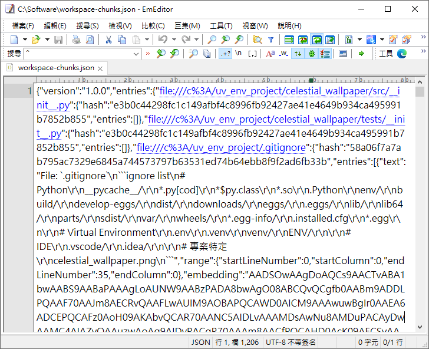
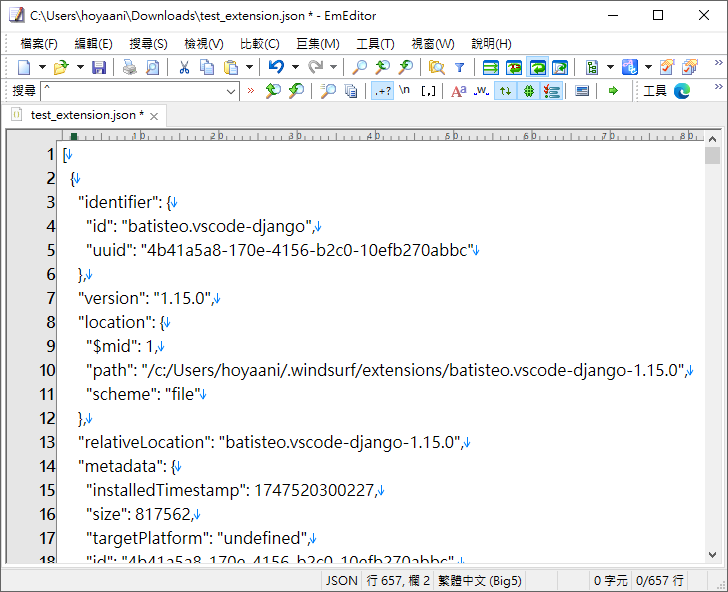

# IDE_extension_json_format_marco

🇨🇳 中文說明

## EmEditor JSON 格式化巨集

本專案提供一個 EmEditor 巨集腳本，用於格式化 Visual Studio Code Extension 的 JSON 檔案。  
特點如下：

- 僅使用 ECMAScript ES2 支援的方法，兼容性高。
- 僅使用 if、for、switch 三種基本判斷式，程式碼簡潔。
- 不含偵錯檢查及訊息框，純粹專注於格式化功能。
- 可自訂縮排字元與縮排寬度。
- 適用於 EmEditor 巨集環境。

### 使用方式

1. 將 `VS_Code_Extension_JSON_format_v3.jsee` 巨集檔下載到本地端。
2. 於 EmEditor 中開啟要格式化的 JSON 檔案。

3. 執行巨集檔，檔案內容即會自動格式化。

### 注意事項

- 僅支援標準 JSON 格式，若原始檔有語法錯誤，巨集執行可能失敗。
- 本巨集無錯誤提示，如遇問題請確認 JSON 格式正確。

### 授權

本專案採用 [GNU General Public License v3.0](LICENSE)。

🇺🇸 English

## EmEditor JSON Formatting Macro

This project provides an EmEditor macro script for formatting JSON files, specifically for Visual Studio Code Extension JSON files.  
Features include:

- Uses only ECMAScript ES2 supported methods for maximum compatibility.
- Only utilizes `if`, `for`, and `switch` statements—clean and simple code structure.
- No debugging or message dialogs, focused solely on formatting.
- Indentation character and width are customizable.
- Designed for EmEditor macro environment.

### Usage

1. Download the `VS_Code_Extension_JSON_format_v3.jsee` macro file to your local machine.
2. Open the JSON file you want to format in EmEditor.
3. Run the macro file, and the content will be automatically formatted.

### Notes

- Only standard JSON format is supported. If the original file contains syntax errors, the macro may fail.
- No error prompts are provided. Please ensure your JSON is valid if issues occur.

### License

This project is licensed under the [GNU General Public License v3.0](LICENSE).

🇯🇵 日本語

## EmEditor JSON フォーマットマクロ

本プロジェクトは、Visual Studio Code 拡張機能向け JSON ファイルの整形に特化した EmEditor 用マクロスクリプトを提供します。  
主な特徴：

- ECMAScript ES2 でサポートされるメソッドのみを使用し、高い互換性を実現。
- if、for、switch のみを使用したシンプルな構成。
- デバッグやメッセージダイアログなし、整形機能に特化。
- インデント文字や幅をカスタマイズ可能。
- EmEditor マクロ環境専用。

### 使い方

1. `VS_Code_Extension_JSON_format_v3.jsee` マクロファイルをローカルにダウンロードします。
2. EmEditor で整形したい JSON ファイルを開きます。
3. このマクロファイルを実行すると、内容が自動的に整形されます。

### 注意事項

- 標準的な JSON フォーマットのみ対応しています。元ファイルに構文エラーがある場合、マクロの実行に失敗することがあります。
- エラーメッセージ等はありません。不具合時は JSON の構文を確認してください。

### ライセンス

本プロジェクトは [GNU General Public License v3.0](LICENSE) のもとで公開されています。

