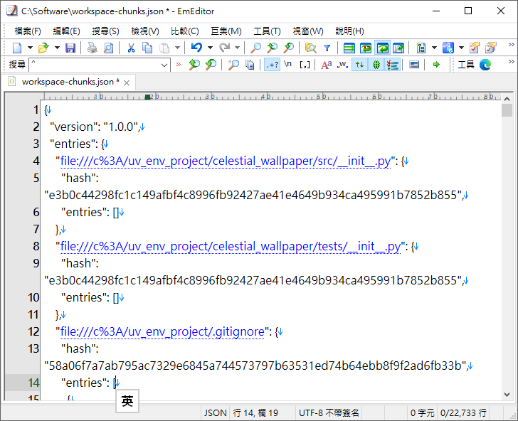

<!-- 語言切換（右上角） -->
[🇺🇸 English](#english)  
[🇯🇵 日本語](#日本語)

# IDE_extension_json_format_marco

## EmEditor JSON 格式化巨集

本專案提供一個 EmEditor 巨集腳本，用於格式化 Visual Studio Code Extension 的 JSON 檔案。  
特點如下：

- 僅使用 ECMAScript ES2 支援的方法，兼容性高。
- 僅使用 if、for、switch 三種基本判斷式，程式碼簡潔。
- 不含偵錯檢查及訊息框，純粹專注於格式化功能。
- 可自訂縮排字元與縮排寬度。
- 適用於 EmEditor 巨集環境。

### 使用方式

1. 將 `VS_Code_Extension_JSON_format_v3.jsee` 巨集檔下載到本地端。
2. 於 EmEditor 中開啟要格式化的 JSON 檔案。

3. 執行巨集檔，檔案內容即會自動格式化。

### 注意事項

- 僅支援標準 JSON 格式，若原始檔有語法錯誤，巨集執行可能失敗。
- 本巨集無錯誤提示，如遇問題請確認 JSON 格式正確。

### 授權

本專案採用 [GNU General Public License v3.0](LICENSE)。

## 關於本巨集與 EmEditor 的關係

本巨集（macro script）為第三方用戶自製，僅設計於 EmEditor 編輯器環境下執行。  
本專案與 EmEditor 的開發公司或官方團隊無任何直接關聯，也未經官方背書或授權。

EmEditor 為 Emurasoft, Inc. 的註冊商標與著作權所有。  
本專案僅利用 EmEditor 公開之巨集功能或 API 進行擴充，未包含或修改任何 EmEditor 原始程式碼。

如需瞭解 EmEditor 之授權與使用規範，請參考 [EmEditor 官方網站](https://www.emeditor.com/)。

## English

## EmEditor JSON Formatting Macro

This project provides an EmEditor macro script for formatting JSON files, specifically for Visual Studio Code Extension JSON files.  
Features include:

- Uses only ECMAScript ES2 supported methods for maximum compatibility (EmEditor only supports up to incomplete ECMAScript 5.1, most properties or methods may not work properly).
- Only uses basic `if`, `for`, and `switch` statements, resulting in concise code (modern try_catch often causes macro errors).
- No file debugging or message dialogs (which may cause macro errors), as EmEditor's JavaScript support is incomplete.
- The initial values for indentation character (`indentChar`) and width (`indentSize`) are customizable.
- Designed for the EmEditor macro environment.

### Usage

1. Download the `VS_Code_Extension_JSON_format_v3.jsee` macro file to your local machine.  
   Place the macro file in the /Macros subfolder of your software directory. In the menu, select [Macro] -> [Customize] -> [Add], choose the macro, then click [OK].
2. Open the JSON file you want to format in EmEditor.  
   
3. In the [Macro] menu, click the loaded macro to execute it. The file content will be automatically formatted.  
   

### Notes

- Only standard JSON format is supported. If the original file contains syntax errors, the macro may fail.
- No error prompts are provided. Please ensure your JSON is valid if issues occur.

### License

This project is licensed under the [GNU General Public License v3.0](LICENSE).

## About the Relationship Between This Macro and EmEditor

This macro script is independently developed by a third-party user and is designed to run within the EmEditor editor environment only.  
This project has no direct affiliation with or endorsement from the EmEditor development company or official team.

EmEditor is a registered trademark and the copyright of Emurasoft, Inc.  
This project utilizes only the publicly available macro features or APIs provided by EmEditor and does not include or modify any original EmEditor source code.

For details on EmEditor's license and usage policy, please refer to the [official EmEditor website](https://www.emeditor.com/).

## 日本語

## EmEditor JSON フォーマットマクロ

本プロジェクトは、Visual Studio Code 拡張機能向け JSON ファイルの整形に特化した EmEditor 用マクロスクリプトを提供します。  
主な特徴：

- ECMAScript ES2 でサポートされているメソッドのみを使用し、高い互換性を実現（EmEditor は不完全な ECMAScript 5.1 までしか対応しておらず、多くのプロパティやメソッドが正しく動作しない場合があります）。
- 基本的な `if`、`for`、`switch` のみを使用し、シンプルなコード構成（新しい try_catch はよくマクロのエラー原因となります）。
- ファイルのデバッグやメッセージダイアログは含まれていません（これらはマクロエラーの原因となるため）。EmEditor の JavaScript サポートは不完全です。
- インデント文字（`indentChar`）や幅（`indentSize`）の初期値をカスタマイズ可能です。
- EmEditor マクロ環境専用です。

### 使い方

1. `VS_Code_Extension_JSON_format_v3.jsee` マクロファイルをローカルにダウンロードしてください。  
   マクロファイルをソフトウェアディレクトリ內の /Macros サブディレクトリに組態し、メニューの [マクロ] → [カスタマイズ] → [追加] からマクロを選択し [OK] をクリックします。
2. EmEditor で整形したい JSON ファイルを開きます。  
   
3. [マクロ] メニューで読み込んだマクロをクリックして実行すると、ファイル內容が自動的に整形されます。  
   

### 注意事項

- 標準的な JSON フォーマットのみ対応しています。元ファイルに構文エラーがある場合、マクロの実行に失敗することがあります。
- エラーメッセージ等はありません。不具合時は JSON の構文を確認してください。

### ライセンス

本プロジェクトは [GNU General Public License v3.0](LICENSE) のもとで公開されています。

## 本マクロとEmEditorとの関係について

本マクロスクリプトは、第三者ユーザーによって独自に開発されたものであり、EmEditorエディタ環境でのみ動作するよう設計されています。  
本プロジェクトは、EmEditorの開発会社または公式チームとは一切関係なく、公式の承認や提携もありません。

EmEditorはEmurasoft, Inc.の登録商標および著作物です。  
本プロジェクトは、EmEditorが公開しているマクロ機能やAPIのみを利用しており、EmEditorのオリジナルソースコードを含んだり、修正したりしていません。

EmEditorのライセンスや利用規約については、[EmEditor公式ウェブサイト](https://www.emeditor.com/)をご参照ください。

