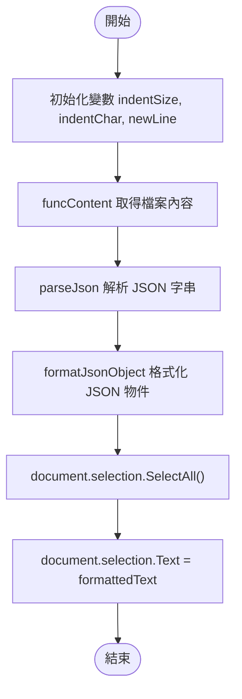
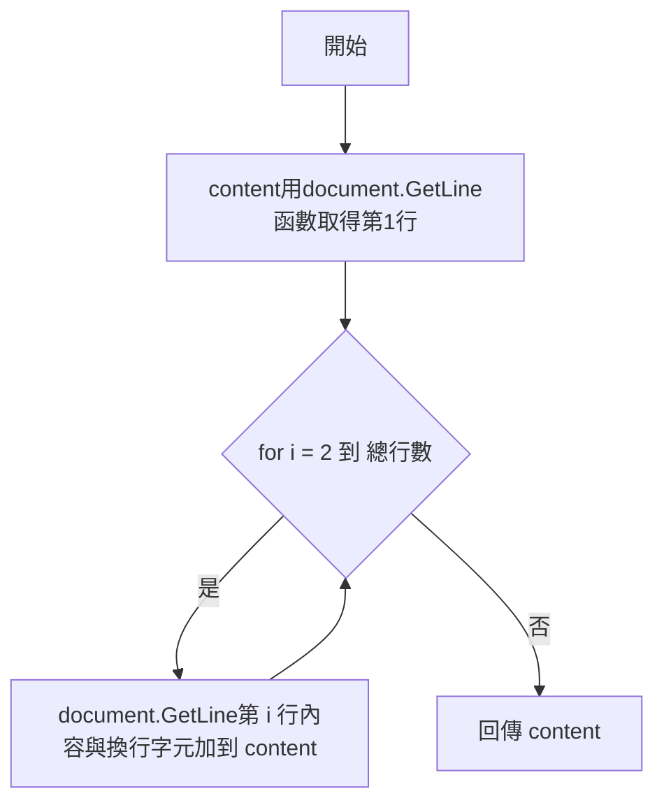
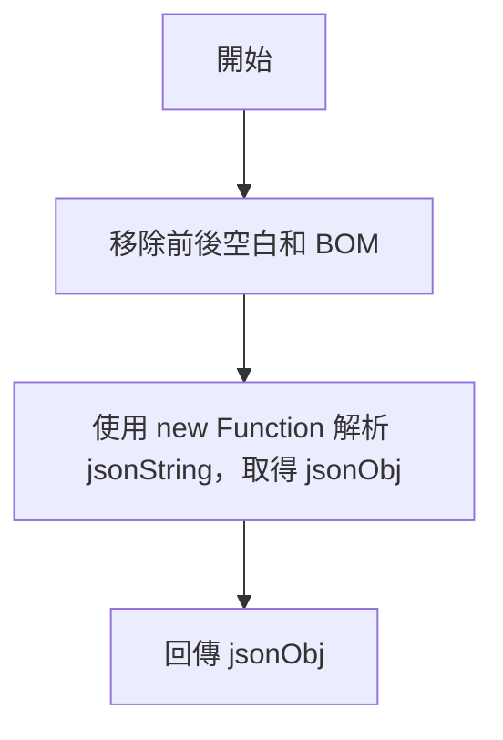
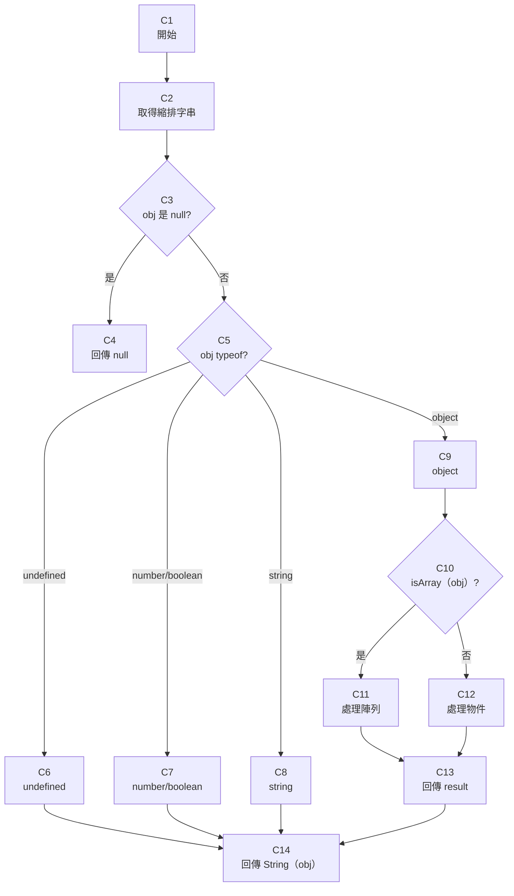
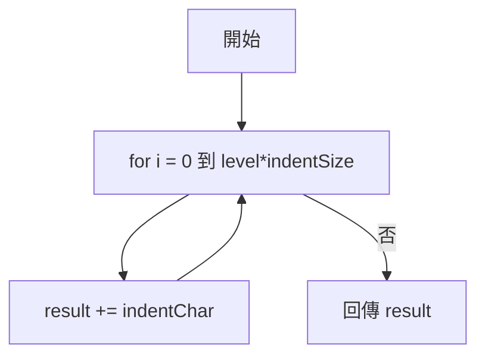
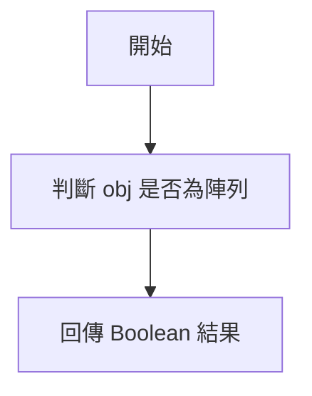
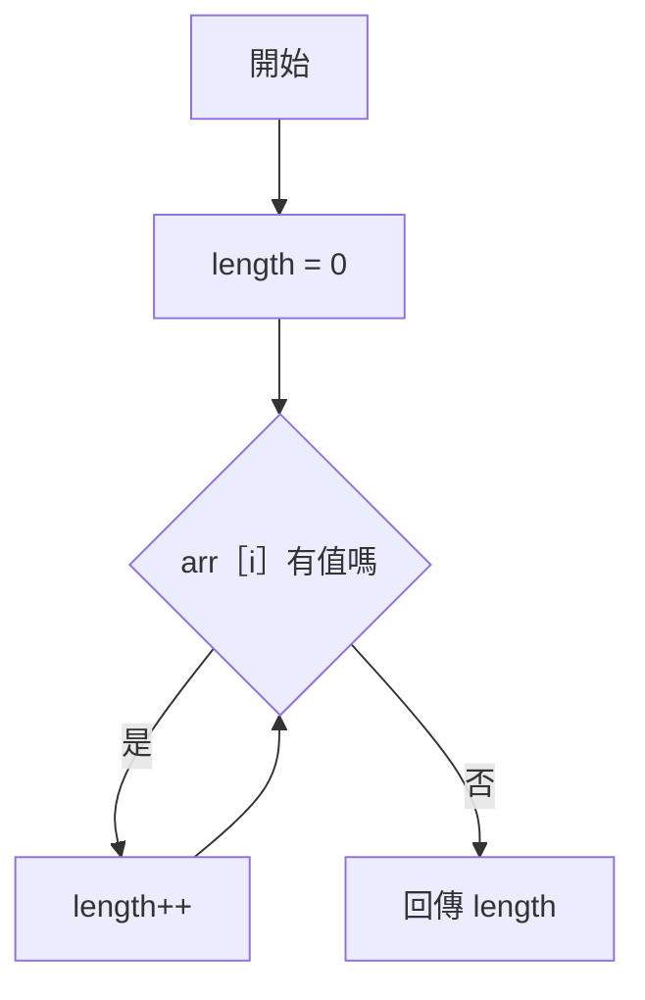
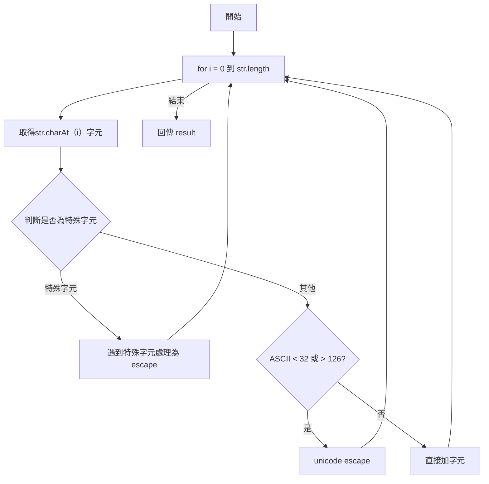
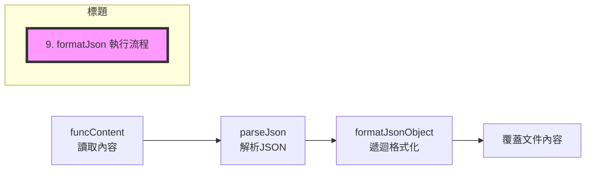

# VS_Code_Extension_JSON_format_v3 巨集腳本流程圖

以下為該巨集的【主要流程圖】以及各函數的【處理邏輯細部流程圖】（以文字流程圖說明，適合轉為繪圖工具繪製）。

---

## 1. 主程序流程圖 (formatJson)

  Start --> Init --> GetContent --> ParseJSON --> FormatObj --> SelectAll --> ReplaceText --> End

---

## 2. funcContent 取得檔案內容

---

## 3. parseJson 解析 JSON 字串

---

## 4. formatJsonObject 格式化 JSON 物件 (核心遞迴)

#### （補充說明：）
- **C11 處理陣列**
  - 若為空陣列，回傳 []
  - 否則：for loop 遞迴 formatJsonObject，逗號分隔，適當加縮排和換行
- **C12 處理物件**
  - 計算屬性數量，若為空物件，回傳 {}
  - 否則：for loop 遞迴 formatJsonObject，逗號分隔，適當加縮排和換行

---

## 5. getIndent 取得縮排

---

## 6. isArray 檢查是否為陣列

---

## 7. getArrayLength 取得陣列長度

---

## 8. escapeString 轉義字串

---

## 9. formatJson 執行流程

---

### 補充說明

- **主要邏輯遞迴在 formatJsonObject**，根據類型判斷與格式化。
- **escapeString 處理所有字串輸出安全**。
- **處理簡單 for/if/switch，符合 ECMAScript v2 語法限制**。

---

> 你可以將以上 Mermaid 流程圖直接貼入流程圖工具（如 mermaid.live、draw.io、ProcessOn 等）進行視覺化繪製。